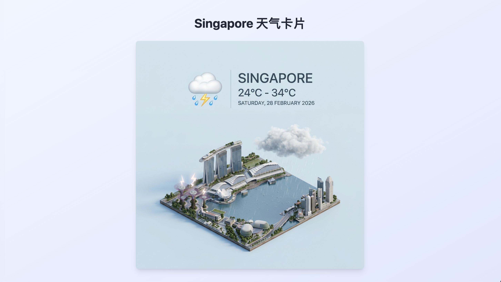
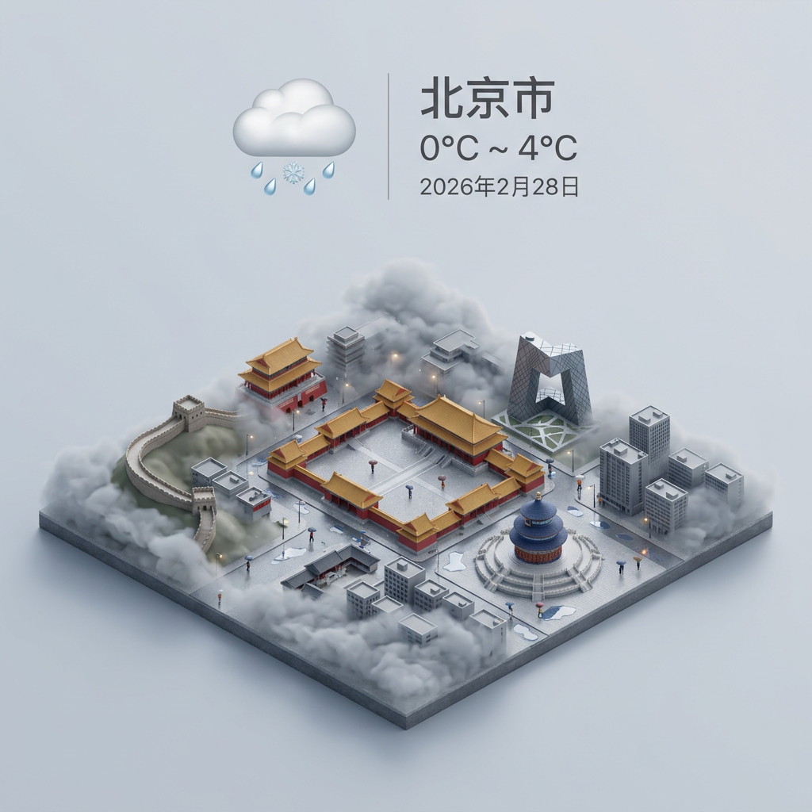

# City Card - 智能城市天气卡片生成器

City Card 是一个基于 Next.js 16 和 Cloudflare 构建的智能城市天气卡片生成应用。它能够根据用户的地理位置自动获取城市信息，并使用 AI 生成精美的天气卡片图像。

## 项目特性

- 📍 **自动定位**：使用浏览器地理定位获取当前位置
- 🌍 **反向地理编码**：通过坐标获取城市名称（基于 OpenStreetMap Nominatim）
- 🤖 **AI 图像生成**：使用 Google AI Studio (Gemini 3.1 Flash) 生成高质量天气卡片
- 📦 **云存储**：天气卡片图像存储在 Cloudflare R2 对象存储中
- 🎨 **精美的设计**：使用 Tailwind CSS 实现现代、响应式的用户界面
- 🔄 **缓存机制**：已生成的天气卡片会被缓存，提高加载速度
- 🚀 **部署在 Cloudflare**：使用 OpenNext 部署到 Cloudflare Pages

## 技术栈

- **框架**：Next.js 16.1.6
- **语言**：TypeScript
- **UI 框架**：Tailwind CSS 3.4.0
- **AI**：Google Generative AI (Gemini 3.1 Flash)
- **部署**：Cloudflare Pages + OpenNext
- **存储**：Cloudflare R2 对象存储
- **地图**：OpenStreetMap Nominatim API

## 安装

### 前置要求

- Node.js >= 18.0.0
- npm 或 yarn
- Cloudflare 账户（用于部署）

### 安装依赖

```bash
npm install
```

### 配置环境变量

创建 `.dev.vars` 文件（本地开发）和 Cloudflare Pages 环境变量：

```bash
# Cloudflare AI Gateway
AI_GATEWAY = "your-ai-gateway"

# Cloudflare R2 存储桶
WEATHER_CARDS_R2_BUCKET = "your-r2-bucket-name"

# Google AI Studio API（可选，如使用直接 API 访问）
GOOGLE_API_KEY = "your-google-api-key"
```

### 本地开发

```bash
npm run dev
```

访问 `http://localhost:3000` 查看应用。

### 生产构建

```bash
npm run build
```

## 部署

### 部署到 Cloudflare Pages

```bash
# 预览部署
npm run preview

# 正式部署
npm run deploy
```

或通过 Cloudflare Pages 控制台手动部署。

## 项目截图

### 主界面


### 天气卡片示例



## 使用方法

1. 打开应用后，浏览器会请求地理位置权限
2. 允许权限后，应用会自动获取您的位置
3. 通过坐标查询城市名称
4. 调用 AI 生成天气卡片图像
5. 显示生成的天气卡片

### 刷新天气卡片

如果需要刷新天气卡片，可以点击"重试"按钮或刷新页面。

## API 文档

### 获取天气卡片

**接口**：`GET /api/image?city=<城市名称>`

**参数**：
- `city`：城市名称（必填），支持中文、英文等多种语言

**成功响应**：
```json
{
  "imageUrl": "https://card-r2.undownding.dev/2024-02/27/beijing.webp"
}
```

**错误响应**：
```json
{
  "error": "City parameter is required"
}
```

**状态码**：
- 200：成功
- 400：参数缺失或无效
- 500：服务器内部错误

**示例**：
```bash
curl "http://localhost:3000/api/image?city=北京"
```

### 反向地理编码

**接口**：`GET /api/reverse-geocode?lat=<纬度>&lon=<经度>`

**参数**：
- `lat`：纬度（必填），范围：-90 到 90
- `lon`：经度（必填），范围：-180 到 180

**成功响应**：
```json
{
  "address": {
    "city": "北京",
    "town": null,
    "village": null,
    "country": "中国",
    "country_code": "cn",
    "postcode": "100000",
    "state": "北京市"
  }
}
```

**错误响应**：
```json
{
  "error": "lat and lon parameters are required"
}
```

**状态码**：
- 200：成功
- 400：参数缺失或无效
- 500：服务器内部错误
- 502：第三方 API 服务错误

**示例**：
```bash
curl "http://localhost:3000/api/reverse-geocode?lat=39.9042&lon=116.4074"
```

## 项目结构

```
├── app/
│   ├── api/
│   │   ├── image/
│   │   │   └── route.ts      # 生成天气卡片 API
│   │   └── reverse-geocode/
│   │       └── route.ts      # 反向地理编码 API
│   ├── layout.tsx            # 根布局
│   ├── page.tsx              # 主页面
│   └── globals.css           # 全局样式
├── public/                   # 静态资源
├── .dev.vars                 # 本地开发环境变量
├── next.config.ts            # Next.js 配置
├── open-next.config.ts       # OpenNext 配置
├── tailwind.config.ts        # Tailwind CSS 配置
├── wrangler.jsonc           # Cloudflare Wrangler 配置
└── package.json              # 项目依赖
```

## 故障排除指南

### 常见问题

#### 1. 地理位置权限被拒绝

**症状**：显示错误信息“您拒绝了位置请求”

**解决方法**：
- 刷新页面，重新允许地理位置权限
- 检查浏览器设置，确保地理位置权限未被全局禁用
- 尝试使用其他浏览器

#### 2. 无法获取城市信息

**症状**：显示错误信息“无法获取城市信息”

**解决方法**：
- 检查网络连接
- 确认设备的 GPS 功能正常
- 尝试刷新页面重试

#### 3. 天气卡片生成失败

**症状**：显示错误信息“无法获取天气卡片图片”

**解决方法**：
- 检查网络连接
- 刷新页面重试
- 确认 Cloudflare AI Gateway 配置正确
- 检查 Google AI Studio API 密钥是否有效（如使用直接 API 访问）

#### 4. 本地开发环境问题

**症状**：无法启动开发服务器或 API 无法正常工作

**解决方法**：
- 确认 Node.js 版本 >= 18.0.0
- 删除 `node_modules` 并重新安装依赖：
  ```bash
  rm -rf node_modules package-lock.json
  npm install
  ```
- 检查 `.dev.vars` 文件中的环境变量配置是否正确

## 开发环境常见问题

### 1. Cloudflare 资源绑定错误

**错误信息**：`Error: WEATHER_CARDS_R2_BUCKET is not available`

**解决方法**：
- 确认 `wrangler.jsonc` 中已正确配置资源绑定
- 检查 `.dev.vars` 文件中的桶名称是否正确
- 确认 Cloudflare R2 存储桶已创建

### 2. AI Gateway 连接问题

**错误信息**：`Error: AI instance not available`

**解决方法**：
- 确认 Cloudflare AI Gateway 配置正确
- 检查 `wrangler.jsonc` 中的 `ai` 资源绑定
- 确认 AI Gateway 服务可用

### 3. 构建失败

**错误信息**：构建过程中出现各种错误

**解决方法**：
- 清理构建缓存：
  ```bash
  rm -rf .next .open-next dist
  ```
- 重新构建：
  ```bash
  npm run build
  ```

## 开发指南

### 添加新功能

1. 创建或修改 `app/page.tsx` 实现 UI
2. 在 `app/api/` 目录下创建新的 API 路由
3. 在 `wrangler.jsonc` 中配置 Cloudflare 资源绑定
4. 在 `.dev.vars` 中添加开发环境变量

### 测试

```bash
# 运行 ESLint
npm run lint
```

### 构建优化

- 使用 `npm run build` 生成生产版本
- 构建产物会自动优化以提高性能

## 贡献指南

### 提交规范

请遵循以下提交消息格式：

```
type(scope): description

body (optional)

footer (optional)
```

**类型（type）**：
- feat：新功能
- fix：修复 bug
- docs：文档更新
- style：代码格式调整（不影响功能）
- refactor：代码重构
- test：测试相关
- chore：构建过程或辅助工具的变动

**范围（scope）**：
- api：API 路由
- ui：用户界面
- config：配置文件
- deps：依赖更新

**示例**：
```
feat(api): 添加天气卡片缓存机制

添加 Redis 缓存支持，提高天气卡片获取速度

Closes #123
```

### 开发流程

1. Fork 仓库
2. 创建特性分支：`git checkout -b feat/your-feature`
3. 提交更改：`git commit -m "feat: 添加新功能"`
4. 推送到分支：`git push origin feat/your-feature`
5. 创建 Pull Request

### 代码规范

- 使用 TypeScript 进行开发
- 遵循 ESLint 规则
- 使用 Prettier 格式化代码
- 保持代码简洁和可读性
- 为关键函数添加类型注解

## 许可证

MIT License

## 许可证

MIT License

## 联系方式

如有问题或建议，请通过以下方式联系：

- 邮箱：support@city-card.local
- GitHub：[github.com/undownding/city-card](https://github.com/undownding/city-card)

## 更新日志

### v0.1.0 (2026-02-27)

- 初始版本发布
- 支持自动定位和城市识别
- 集成 Google AI Studio 图像生成
- 使用 Cloudflare R2 存储天气卡片
